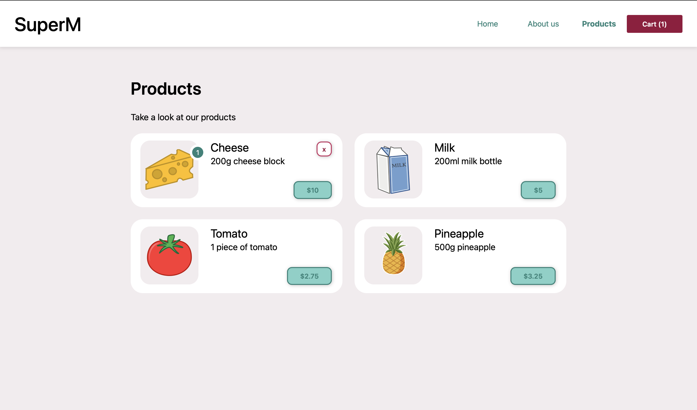

# Online store with react

This is the finished Project from the [React Tutorial course](https://react-tutorial.app)

 &nbsp;

 &nbsp;

## Pictures

 &nbsp;

 &nbsp;

## React concepts I learned
- JSX
- Props
- State
- Hooks
- Effect
- Components
- Immutability
- Events
- Forms
- Lifting state up
- Passing props down
- Using APIs & fetch
- Custom hooks
- Restoring from localStorage
- React Router
- and many more!

 &nbsp;

 &nbsp;

## Run this website locally
To run this project locally, we use the npm package manager and Parcel.

 &nbsp;

1. Install parcel (if not already done)
> npm install -g parcel-bundler

 &nbsp;

2. Set up npm
> npm init -y

 &nbsp;

3. Run a live server
> npx parcel src/index.html

 &nbsp;

4. (Optional) build for Production
> npx parcel build src/index.html --no-source-maps --public-url . --no-cache